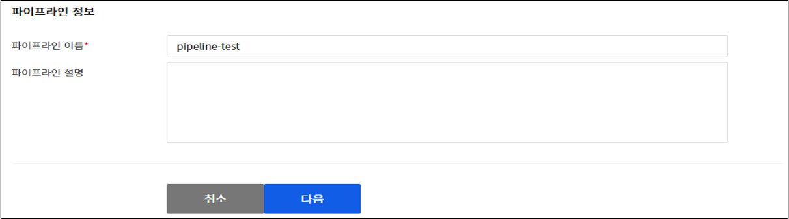

# nhn-pipline
NHN Pipeline  Devtools Pipeline 이용한 CICD

## pipeline 생성 과정 및 운영


### 1. pipeline 정보 입력
> * 파이프라인 이름 및 설명 설정


### 2. 빌드할 소스코드 선택
> * 빌드할 소스가 있는 소스 저장소 설정
> * jenkins 빌드 시 해당 STEP 건너뛰기


### 3. 빌드도구 선택
#### - jenkins를 활용할 경우
> * jenkins 활용 시 미리 jenkins 설치와 job을 생성하는 과정이 필요함 <br>
> * jenkins 에서 이미지 저장소 접근을 위한 credential 추가 <br>

> * pipeline job 예시<br>
> 
```
node {
    def GITLAB_CODE_REPO_URL = 'http://github.com/soobnii/sht.git';
    def app;
    stage('Clone Sources') { // github에서 소스 얻어오기
        dir("soob/source") {
            git branch: "master", url: GITLAB_CODE_REPO_URL
        }
    }
    stage('code build') { // maven으로 코드 빌드
        dir("soob/source"){
           sh 'mvn package' 
        }
    }
    stage('docker build') { // Dockerfile로 빌드 (이미지 생성)
        dir("soob/source"){
            app = docker.build("cbb06093-kr1-registry.container.cloud.toast.com/tomcat8-soob")
        }
    }
    stage('docker push') { // 이미지 push
        docker.withRegistry('http://cbb06093-kr1-registry.container.cloud.toast.com', 'cbb06093-kr1-registry.container.cloud.toast.com') {            
            app.push("${env.BUILD_NUMBER}")            
            app.push("latest")        
        }
    }
}
```


#### - NHN 빌드도구를 활용할 경우
> * NHN 빌드도구는 별도의 SW (ex. Jenkins) 설치 없이 소스 코드 빌드, 이미지 생성 및 업로드 과정을 수행할 수 있음 <br> 
> * 단, 이미지 저장소에 빌드에 사용할 컨테이너 이미지가 업로드 되어 있어야 함 (ex. maven)
> 
```
docker pull maven:3.8-jdk-8-openj9
docker tag maven:3.8-jdk-8-openj9 cbb06093-kr1-registry.container.cloud.toast.com/maven-soob
docker login cbb06093-kr1-registry.container.cloud.toast.com 
# username : info100@injeinc.co.kr (NHN cloud 아이디) Password : Container Registry 화면 URL & Appkey 버튼 클릭시 확인가능
docker push cbb06093-kr1-registry.container.cloud.toast.com/maven-soob:latest
```
> * `현재 해당 스테이지에서 503 error 발생하여 확인중` <br> 
.png) <br>


### 4. 배포 환경 선택
> * 쿠버네티스 클러스터 선택 및 이미지 배포방식 설정 <br>
> * yaml 형식으로 입력
> * 미리 서비스파드가 실행중인 상태로, Deployment 실행 시 RollingUpdate 됨
> 
```
apiVersion: apps/v1
kind: Deployment
metadata:
    labels:
        app: soob-app
    name: soob-app
    namespace: soob
spec:
    replicas: 1
    selector:
        matchLabels:
            app: soob-app
    template:
        metadata:
            labels:
                app: soob-app
        spec:
            containers:
                -
                    image: 'cbb06093-kr1-registry.container.cloud.toast.com/tomcat8-soob:latest'
                    name: soob-app
                    ports:
                        -
                            containerPort: 8080
                            name: soob-app
            imagePullSecrets:
                -
                    name: nhn-registry-auth
```
> * (참조) 최초 생성 시 secret_deploy_service.yaml 참조 
> 
```
kubectl create -f secret_deploy_service.yaml
```
> * (참조) Secret 상성 시 인코딩된 value 구하는 방법
> 
```
 docker login cbb06093-kr1-registry.container.cloud.toast.com
 cd .docker
 base64 config.json
```

> * (참조) config.json
> 
```
{
	"auths": {
		"cbb06093-kr1-registry.container.cloud.toast.com": {
			"auth": "aW5mbzEwMEBpbmplaW5jLmNvLmtyOkRkMWJmZFZvWEJNNHdRUUw="
		}
	}
}
```


### 5. 자동 실행 설정
> * 자동 실행 유형 : GitHub / 이미지 저장소 (webhooks 등록 필요)
> * 설정한 GitHub 레포지토리에 이벤트 발생 or 이미지 저장소의 특정 이미지 UPDATE 시 해당 파이프라인이 자동으로 실행됨
> * 단, 파이프라인의 자동 실행 방지는 `미사용` 으로 설정되어 있어야 함 <br>


### 6.스테이지 추가
> * 파이프라인 생성 후 스테이지 추가, 변경 가능
> * 추가 시 Deploy 단계에서 **PATH, SCALE, ROLLOUT UNDO, DELETE** 작업 추가 가능
.png)
.png)


